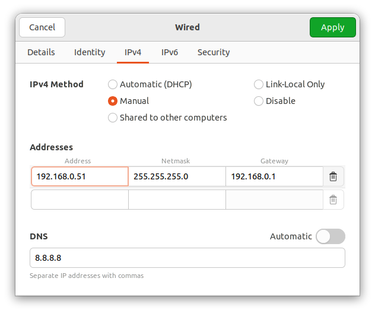
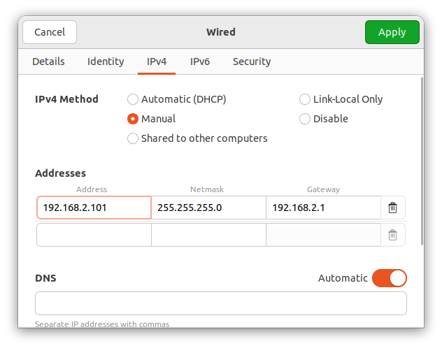
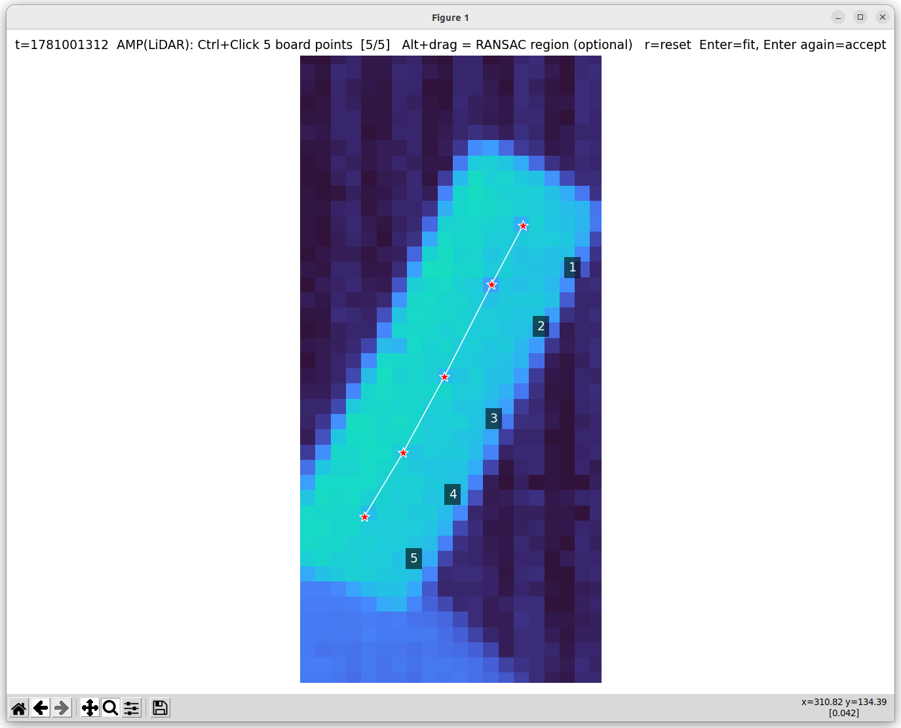
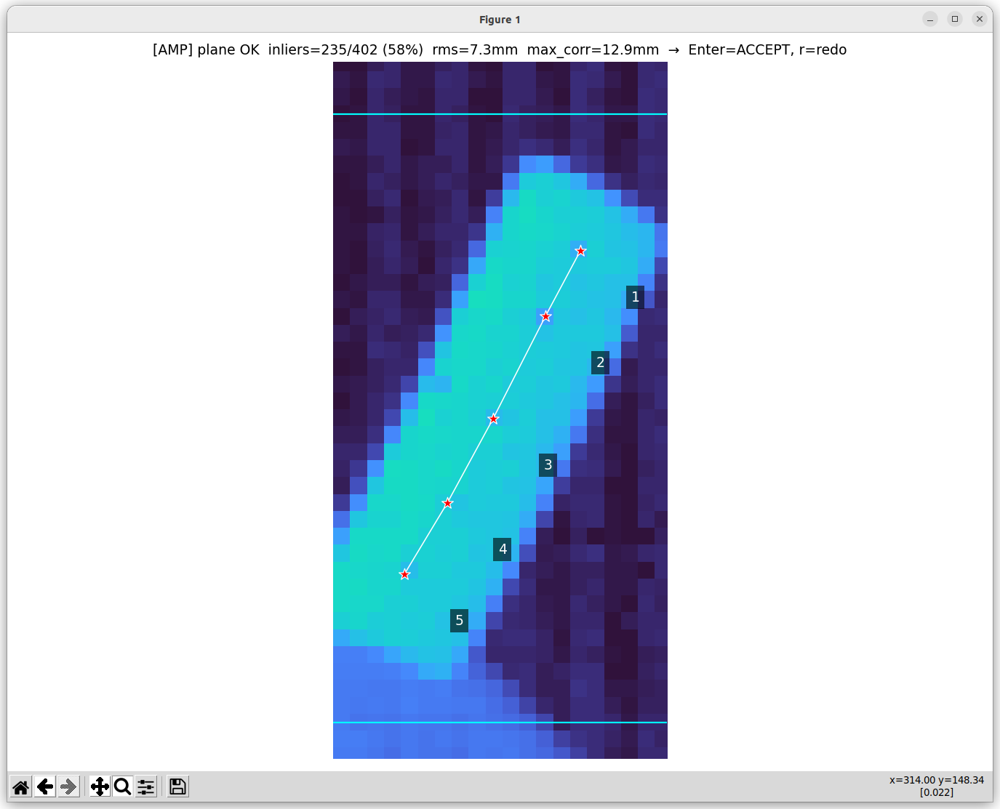
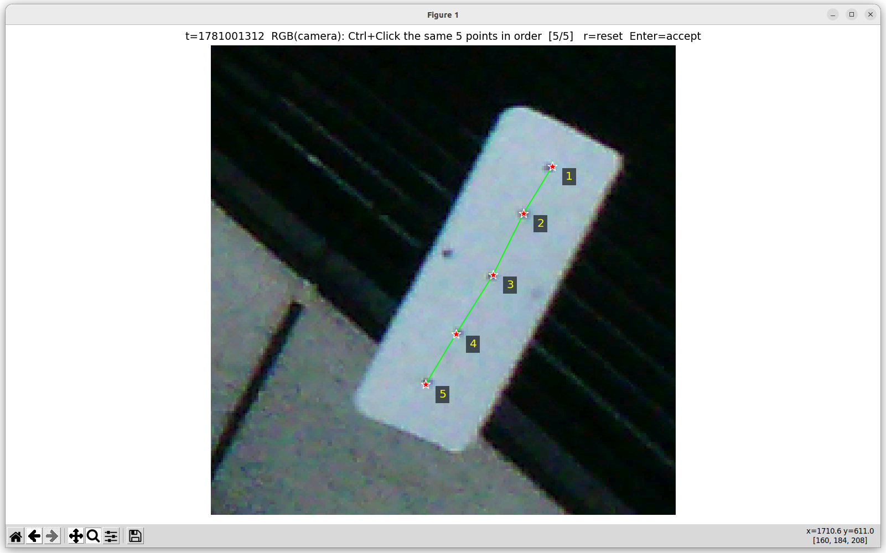
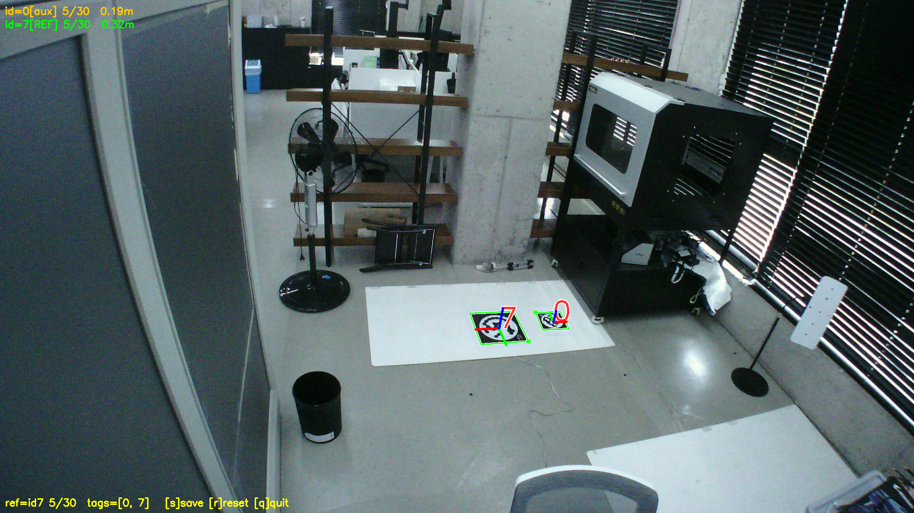

# NSL-3130AA ROS2

ROS2 Humble driver for the NanoSystems NSL-3130AA Time-of-Flight camera.

**환경**: Ubuntu 22.04 LTS / ROS2 Humble / OpenCV 4.5+

---

## Quick Summary

기본 운용은 아래 명령만 실행하면 Set 번호 기준으로 자동 정리됩니다. Edge의 `192.168.0.N` 주소가 namespace, 카메라 IP, TF frame 이름의 기준으로 사용됩니다.

```bash
# 최초 1회
sudo bash ~/colcon_ws/src/NSL-3130AA-ROS2/setup/install_libusb_linux.sh
cd ~/colcon_ws
colcon build
source install/setup.bash

# Edge 원터치 셋업: DDS + 카메라 IP + namespace 규칙이 자동 적용됩니다
bash ~/colcon_ws/src/NSL-3130AA-ROS2/setup/setup_fleet_edge.bash

# 평시 실행
ros2 launch roboscan_nsl3130 camera.launch.py

# 멀티 Edge 운용: Edge는 headless, Host는 multiview RViz만 실행됩니다
ros2 launch roboscan_nsl3130 camera.launch.py use_rviz:=false use_rqt:=false
ros2 launch roboscan_nsl3130 multiview.launch.py
```

| 목적 | 핵심 입력문 | 적용 결과 |
|---|---|---|
| Edge/카메라 자동 셋업 | `bash ~/colcon_ws/src/NSL-3130AA-ROS2/setup/setup_fleet_edge.bash` | `/cam_N`, `192.168.2.(N+150)`, FastDDS LAN pinning이 자동 적용됩니다 |
| 주소 확인만 | `bash ~/colcon_ws/src/NSL-3130AA-ROS2/setup/setup_fleet_edge.bash --check` | Set 번호와 카메라 NIC/IP 규칙만 출력됩니다 |
| Host 셋업 | `bash ~/colcon_ws/src/NSL-3130AA-ROS2/setup/setup_fleet_edge.bash --host-only` | 카메라 IP는 건드리지 않고 DDS/ROS 환경만 정리됩니다 |
| 카메라 실행 | `ros2 launch roboscan_nsl3130 camera.launch.py` | 시리얼별 params, namespace, TF, RViz/rqt가 자동 적용됩니다 |
| Edge headless 실행 | `ros2 launch roboscan_nsl3130 camera.launch.py use_rviz:=false use_rqt:=false` | Edge는 퍼블리시만 하고, 화면 표시는 Host에서 처리됩니다 |
| Host multiview | `ros2 launch roboscan_nsl3130 multiview.launch.py` | 모든 Edge의 `/cam_N` 포인트클라우드가 `stag_marker` 기준으로 표시됩니다 |

**Calibration 핵심 입력문**

```bash
# 카메라는 calibration 프로파일로 실행됩니다
ros2 launch roboscan_nsl3130 camera.launch.py calibration:=true

# 1. RGB intrinsic
ros2 launch roboscan_nsl3130 intrinsic_calib.launch.py

# 2. LiDAR-RGB extrinsic
ros2 launch roboscan_nsl3130 extrinsic_calib.launch.py

# 3. STag multiview
ros2 launch roboscan_nsl3130 multiview.launch.py calibration:=True
```

---

## 0. 클론 (최초 1회)

아래와 같이 명령어를 실행시켜 주세요.


```bash
mkdir -p ~/colcon_ws/src
cd ~/colcon_ws/src
git clone --recurse-submodules https://github.com/zzapzzap/NSL-3130AA-ROS2.git
```

이후 명령은 기본적으로 **`~/colcon_ws`** 에서 실행됩니다.

---

## 1. 최초 준비 (1회만)

운영/초기화용 shell 스크립트는 `setup/` 폴더에 모여 있습니다.

| 스크립트 | 용도 |
|---|---|
| `setup/install_libusb_linux.sh` | libusb/udev 설치 |
| `setup/setup_fleet_edge.bash` | Edge DDS 설정 + 카메라 IP 자동 세팅 |
| `setup/setup_dds_interface.bash` | FastDDS를 `192.168.0.x` LAN으로 제한 |
| `setup/intrinsic_calib.sh` | RGB intrinsic 캘리브레이션 |
| `setup/extrinsic_calib.sh` | LiDAR↔RGB extrinsic 캘리브레이션 |

### 1-1. USB 드라이버 & udev 규칙

아래와 같이 명령어를 실행시켜 주세요.

```bash
sudo bash ~/colcon_ws/src/NSL-3130AA-ROS2/setup/install_libusb_linux.sh
```

설치 후 USB 케이블을 뽑았다 다시 꽂으면 `lsusb`에 `1fc9:0099`가 표시됩니다.

---

### 1-2. Fleet IP 규칙

Set 번호 `N`은 Edge의 DDS/LAN 마지막 번호입니다. `N=51`부터 시작하고, 같은 번호에서 카메라망 주소도 자동으로 따라옵니다.

| Set | DDS/LAN | 카메라 NIC | 카메라 IP | namespace |
|---|---|---|---|---|
| 51 | `192.168.0.51` | `192.168.2.101` | `192.168.2.201` | `/cam_51` |
| 52 | `192.168.0.52` | `192.168.2.102` | `192.168.2.202` | `/cam_52` |
| ... | ... | ... | ... | ... |
| 59 | `192.168.0.59` | `192.168.2.109` | `192.168.2.209` | `/cam_59` |

- Host는 보통 `192.168.0.10` 같은 공유 LAN 주소만 씁니다.
- Edge는 NIC 2개를 씁니다: 공유 LAN `192.168.0.N`, 카메라 전용 NIC `192.168.2.(N+50)`.
- 카메라 자체 IP는 `192.168.2.(N+150)`로 저장합니다.
- 카메라망 Gateway는 GUI와 카메라 설정 모두 `192.168.2.1`로 둡니다.

Ubuntu GUI에서는 아래 그림처럼 **IPv4 → Manual**로 설정하세요. 그림은 Set 51 예시입니다. Set 52라면 Edge LAN은 `192.168.0.52`, 카메라 NIC는 `192.168.2.102`가 입력되고 나머지는 동일하게 유지됩니다.

**Edge DDS/LAN NIC (`192.168.0.N`)**



**Camera NIC (`192.168.2.(N+50)`)**



---

### 1-3. Edge/카메라 자동 셋업

각 Edge에서는 아래 한 줄만 실행하세요. 스크립트가 `192.168.0.N`을 읽어 namespace와 카메라 IP를 계산하고, 연결된 카메라가 `192.168.2.(N+150)`으로 자동저장됩니다.

```bash
bash ~/colcon_ws/src/NSL-3130AA-ROS2/setup/setup_fleet_edge.bash
```

예: Edge가 `192.168.0.51`이면 카메라 NIC는 `192.168.2.101`, 카메라는 `192.168.2.201`, 토픽은 `/cam_51/camera/...`가 됩니다.

주소만 확인하려면 `--check`가 사용됩니다:

```bash
bash ~/colcon_ws/src/NSL-3130AA-ROS2/setup/setup_fleet_edge.bash --check
```

카메라 NIC가 규칙과 다르면 카메라 IP는 쓰이지 않고 스크립트가 멈춥니다. NIC 주소를 Set 규칙에 맞춘 뒤 다시 실행하세요.

스크립트가 전원 재인가를 요청하면 카메라 전원을 껐다 켠 뒤 같은 명령을 다시 실행하세요. Host처럼 카메라를 건드리지 않을 머신은 `--host-only` 로 설정됩니다.

---

## 2. 빌드

새 터미널에서는 `source ~/colcon_ws/install/setup.bash` 또는 아래의 명령어를 실행하세요.

```bash
cd ~/colcon_ws
colcon build
source install/setup.bash
```


### 2-1. Python 의존성 (멀티뷰 STag 캘리브용, 머신마다 1회)

[4-3 Multiview (STag) 캘리브레이션](#4-3-multiview-stag-캘리브레이션--카메라-간-공유-기준-프레임)은 마커 검출을 위해 `stag-python` 이 필요합니다. **클론한 모든 머신에서 1회** 설치하세요.

```bash
cd ~/colcon_ws/src/NSL-3130AA-ROS2
python3 -m pip install --user -r requirements.txt
# 또는 최소한:  python3 -m pip install --user stag-python
```

> `sensor_msgs_py`(depth 보정용 포인트클라우드 파싱)·`cv_bridge` 는 ROS 2 Humble에 포함됩니다. 없으면 `sudo apt install ros-humble-sensor-msgs-py ros-humble-cv-bridge`.

---

## 3. 카메라 실행

아래와 같이 명렁어를 실행하세요.

```bash
cd ~/colcon_ws
ros2 launch roboscan_nsl3130 camera.launch.py                  # 범용(general) 프로파일 (기본)
ros2 launch roboscan_nsl3130 camera.launch.py calibration:=true  # 캘리브레이션 프로파일
```

 **연결 경로(기본 `connection:=ethernet`)**: 런타임은 카메라 전용 Ethernet만 사용됩니다. 카메라 IP 저장은 `setup/setup_fleet_edge.bash`에서 끝내고, launch는 스트리밍만 됩니다.

 **토픽 네임스페이스(기본 동작)**: `namespace:=auto`(기본)면 **이 머신의 Set 번호 `N`** 을 따서 `cam_N` 네임스페이스가 붙고, 토픽은 `/cam_N/camera/...` 로 나옵니다(예: `192.168.0.51` → `/cam_51/camera/point_cloud`). rviz 설정도 자동으로 맞춰집니다.
> - 네임스페이스 없이(`/camera/point_cloud`, `/camera/rgb/image_raw` …) 띄울 때만 `namespace:=''` 가 사용됩니다.
> - 직접 지정할 때만 `namespace:=cam_99` 처럼 넘겨집니다.
> - `192.168.0.x` 주소가 없으면 네임스페이스 없이 동작됩니다.
> - **참고**: 파라미터·캘리브레이션 파일은 여전히 **카메라 시리얼**(`calib_output/{시리얼}/`)로 저장됩니다 — 토픽 네임스페이스(`cam_{번호}`)와 파일 키(시리얼)는 분리되어 있습니다.

**센서 프로파일** — 카메라 시리얼에 따라 자동 선택됩니다(드라이버 시작 로그 `[camera] sensor params: ...` / `Loaded params: path=...` 로 확인). 기기마다 진폭 편차가 커서(밝은 기기 vs 어두운 기기) **카메라별 파라미터**를 따로 둡니다.

| 우선순위 | 조건 | 사용 파일 |
|---|---|---|
| 1 | `calibration:=true` | `lidar_params_calibration.yaml` (공용, 보드용) |
| 2 | 시리얼 인식 + 파일 존재 | `calib_output/{시리얼}/params.yaml` (**기기별**) |
| 3 | 시리얼 인식 + 파일 없음 | general을 복사해 `calib_output/{시리얼}/params.yaml` **자동 생성** 후 사용 |
| 4 | 시리얼 인식 실패 | `lidar_params.yaml` (general 기본값 = zzapzzap 베이스라인) |

- 즉 **카메라를 처음 꽂으면** general 기본값으로 `{시리얼}/params.yaml` 이 자동 생성되고, 이후 rqt에서 그 기기에 맞게 다듬으면(예: 어두운 기기는 `MinAmplitude` 더 낮춤) **그 파일에 저장**되어 다음부터 자동 적용됩니다.
- 시리얼이 안 잡히면 그냥 general 기본값으로 동작합니다.
- `params.yaml`과 rqt 파라미터는 센서 튜닝만 다룹니다. 카메라 IP/Gateway는 fleet 공통 launch 값(`camera_ip`, `camera_netmask`, `camera_gateway`)이며, `intrinsic.yml`·`extrinsic.yml`·`multiview.yml`에도 네트워크 설정을 넣지 않습니다.
- **커버리지 핵심**: 정리 필터(Edge/Interference)는 **off**, `MinAmplitude` 는 **낮게**(2~5). 기기가 어두우면 더 낮춰도 신호 한계(≈30~40%)가 있습니다 — 노출(Integration)을 올리면 더 잡히지만 FPS가 급락하니 권장하지 않습니다.
- **Intrinsic/Extrinsic 캘리브레이션 시에는 `calibration:=true`** 실행을 권장합니다.

실행 시 다음이 자동으로 시작됩니다:
- **roboscan_publish_node** — 카메라 드라이버 (USB 시리얼 자동 감지)
- **rviz2** — 포인트클라우드 시각화
- **rqt_reconfigure_combo** — 파라미터 실시간 변경 (12초 후 자동 실행)

**퍼블리시 토픽:** (기본 네임스페이스 적용 시 `{ns}` = `cam_N`. `namespace:=''` 면 접두어 없이 `/camera/rgb/image_raw` 등)

| 토픽 | 타입 | 설명 |
|------|------|------|
| `/{ns}/camera/rgb/image_raw` | `sensor_msgs/Image` | RGB 이미지 |
| `/{ns}/camera/depth/image_raw` | `sensor_msgs/Image` | 거리 이미지 |
| `/{ns}/camera/ampl` | `sensor_msgs/Image` | Amplitude 이미지 |
| `/{ns}/camera/point_cloud` | `sensor_msgs/PointCloud2` | XYZI 포인트클라우드 |
| `/{ns}/camera/point_cloud_rgb` | `sensor_msgs/PointCloud2` | XYZRGB (캘리브레이션 완료 후 활성화) |

**frame_id**: 네임스페이스 기반으로 자동 결정됩니다 → `{ns}_lidar_frame` (예: `cam_51_lidar_frame`)
네임스페이스가 없으면 `lidar_frame`이 사용됩니다.

---

## 4. 캘리브레이션

캘리브레이션 파일이 없으면 SDK 내장 호모그래피로 동작합니다.  
파일이 있으면 캘리브레이션 결과 (K, D, R, t)를 바탕으로 정밀한 XYZRGB 포인트클라우드를 생성합니다.

**아래 순서로 진행하세요**: Intrinsic → Extrinsic (4.1 및 4.2 섹션 참조)

> **네임스페이스 (자동)**: intrinsic/extrinsic 런치도 camera.launch.py와 **똑같이 `cam_N` 으로 토픽 네임스페이스가 맞춰집니다**. 카메라가 기본값(`namespace:=auto`)으로 실행 중이면 캘리브레이션도 **추가 인자 없이** 그대로 실행됩니다(예: `/cam_51/camera/...` 구독).
> - 다른 머신/카메라를 대상으로 할 때만 `namespace:=cam_52` 처럼 넘겨집니다.
> - 카메라가 `namespace:=''` 로 실행 중이면, 캘리브레이션도 `namespace:=''` 로 맞춰집니다.
> - 토픽을 직접 지정할 때만 `image_topic:=... lidar_topic:=...` 로 덮어씁니다.
> - **camera_id(시리얼)** 는 `intrinsic.yml`·결과 저장 경로(`calib_output/{시리얼}/`)에만 쓰이며 USB로 자동감지됩니다 — 토픽 네임스페이스와 별개입니다.

캘리브레이션 산출물은 **카메라 ID 폴더 하나에 모두** 모입니다(파일명에 ID 중복 없음):

```
~/colcon_ws/src/NSL-3130AA-ROS2/calib_output/
  {camera_id}/                 # 예: N0078060D/
    params.yaml                # 센서 튜닝(rqt 저장)
    intrinsic.yml              # K, D (fisheye)
    extrinsic.yml              # R, t (LiDAR→Camera)
    camera_info.yaml           # ROS 형식 사본
    extrinsic/                 # extrinsic 데이터셋
      2D_corners.csv  3D_corners.csv
      debug/NN.png  images/NN.jpg  pointclouds/NN.pcd
```

---

### 4-1. Intrinsic 캘리브레이션

**필요 조건**: `camera.launch.py` 실행 중, 체커보드 준비

아래를 실행하세요.

```bash
cd ~/colcon_ws
ros2 launch roboscan_nsl3130 intrinsic_calib.launch.py
```

(옵션) 체커보드 크기를 지정하는 경우 (내부 코너 수 × 정사각형 한 변 길이(m)):

```bash
ros2 launch roboscan_nsl3130 intrinsic_calib.launch.py board_size:=8x6 square_size:=0.04
```

**진행 방법:**


1. cameracalibrator GUI가 열립니다
2. 체커보드를 카메라 FOV 전체에서 다양한 각도·거리·틸트로 움직입니다
3. 우측 바 `X / Y / Size / Skew` 가 모두 초록색이 되거나 샘플이 40개 이상이 되면 **[CALIBRATE]** 버튼이 활성화됩니다
4. **[CALIBRATE]** 클릭
5. **[SAVE]** 클릭 → 터미널에 아래와 같이 출력되면 정상입니다


```
[intrinsic] Final RMS=2.37  K=1004.4,1005.4  D=[[ 0.054  0.032 -0.031  0.016]]
[intrinsic] Saved → .../calib_output/N00A5060D/intrinsic.yml
```

> **참고**: GUI의 CALIBRATE 결과(`D = [0.0, 0.0, 0.0, 0.0]`)는 cameracalibrator 내부 초기화 문제로 정상적으로 보이지 않습니다.  
> 실제 fisheye 캘리브레이션은 **[SAVE]** 시 터미널에서 별도로 수행되며, 위 출력의 D 값이 실제 저장되는 값입니다.

**생성 결과:**

```
~/colcon_ws/src/NSL-3130AA-ROS2/calib_output/
  {camera_id}/intrinsic.yml
```

```yaml
# 파일 내용 예시 (N00A5060D/intrinsic.yml)
camera_id: "N00A5060D"
image_width: 1920
image_height: 1080
distortion_model: "equidistant"    # Fisheye 모델
camera_matrix: !!opencv-matrix
  rows: 3  cols: 3  dt: d
  data: [ fx, 0, cx, 0, fy, cy, 0, 0, 1 ]
distortion_coefficients: !!opencv-matrix
  rows: 1  cols: 4  dt: d
  data: [ k1, k2, k3, k4 ]
```

**Rectify 결과 확인 (선택):**

캘리브레이션 후 보정 결과가 올바른지 시각적으로 확인할 때는 debug 모드를 사용하세요.

```bash
ros2 launch roboscan_nsl3130 intrinsic_calib.launch.py debug:=true
```


Original(원본) | Rectified(보정) 화면이 나란히 표시됩니다.  
상단 `balance` 트랙바로 크롭 비율을 실시간으로 조정할 수 있습니다 (0 = 검은 테두리 제거, 100 = 전체 픽셀 유지).

> 보정 결과가 이상해 보이면 샘플이 부족하거나 편향된 상태입니다. 캘리브레이션을 다시 수행하세요.

---

### 4-2. Extrinsic 캘리브레이션

**필요 조건**: `camera.launch.py` 실행 중, Intrinsic 완료 (`{camera_id}/intrinsic.yml` 존재)

> `{camera_id}/intrinsic.yml` 파일이 없으면 실행이 즉시 중단됩니다.

아래를 실행하세요.

```bash
cd ~/colcon_ws
ros2 launch roboscan_nsl3130 extrinsic_calib.launch.py
```

**변환 방향**: LiDAR 좌표를 카메라 좌표로 보내는 외부 파라미터를 구합니다 → `x_cam = R · x_lidar + t`

**터미널 키**: `s`=프레임 저장  `c`=캘리브레이션  `r`=초기화  `q`=종료

**한 프레임 저장(`s`) 절차** — LiDAR(Amplitude) → RGB 순서로 **직접 Ctrl+클릭** 합니다.

1. 보드를 카메라와 LiDAR FOV가 겹치는 위치에 고정합니다.
2. 터미널에서 **`s`** → **Amplitude(LiDAR) 창**이 열립니다.
   - (선택) **`Alt`+드래그**(또는 **우클릭 드래그**)로 **RANSAC을 돌릴 영역**이 직접 지정됩니다(주황 점선). 지정하지 않으면 찍은 점들의 bbox가 자동 사용됩니다.
   - 보드 위의 점 `N`개(기본 5개)를 **`Ctrl`+클릭** 으로 찍습니다. (그냥 클릭은 무시됩니다 — 오클릭 방지)
   - **`Enter`** → 지정 영역(또는 점 bbox)에 **RANSAC 평면**을 맞추고, 각 점의 시선(ray)을 그 평면에 투영해 **3D 좌표를 보정**합니다. (raw depth의 노이즈 대신 평면 기하를 사용)
   - 창 제목에 품질이 표시됩니다: `inliers=…/…  rms=…mm  max_corr=…mm`. 만족하면 **`Enter` 한 번 더** → 확정됩니다. 다시 찍을 때는 **`r`** 입니다.
3. 이어서 **RGB(카메라) 창**이 열립니다.
   - **같은 점들을 같은 순서**로 `Ctrl`+클릭하고 **`Enter`**.
4. **두 창 모두 정확히 `N`개**가 찍혀야 한 세트가 저장됩니다. 개수가 어긋나면 그 프레임은 **저장되지 않습니다**(LiDAR만 찍고 RGB를 취소해도 LiDAR도 저장 안 됨).
5. 위치를 바꿔 가며 **2~4를 5회 이상** 반복합니다.
6. **`c`** → solvePnP 로 `R, t` 계산·저장. 콘솔에 **R 행렬·t 벡터·RMSE·LiDAR 기준 카메라 위치**가 출력됩니다:
   ```
   [c] ───── Extrinsic result  (x_cam = R · x_lidar + t) ─────
   [c] inliers=18/20   RMSE=1.83 px
   [c] R =
    [[ ... ]]
   [c] t = [tx, ty, tz]  (metres)
   [c] camera origin in LiDAR frame = [ ... ]  (m)
   ```

**LiDAR Amplitude 선택 예시**



**RANSAC 평면 확인 후 Accept**



**RGB에서 같은 순서로 점 선택**



> **표시/검증**: 두 창 모두 찍은 점에 **번호 별표(★)와 연결선**이 그려져 LiDAR↔RGB 대응을 바로 확인할 수 있습니다. 프레임마다 `calib_output/{camera_id}/extrinsic/debug/NN.png` 에 **Amplitude | RGB 나란히 비교 이미지**가 저장됩니다.

> **Amplitude 대비**: 포화 픽셀(반사·간섭 컬럼)을 제외하고 stretch 하므로 보드가 선명하게 보입니다. 보드가 잘 안 보이면 보드 각도/거리 조정이 필요합니다.

> **RANSAC 품질 기준(권장)**: `inliers 비율 ≥ 80%`, `rms ≤ 10mm` 정도면 양호합니다. 비율이 낮거나 rms가 크면 평면이 아닌 배경이 섞인 상태입니다. 보드만 포함되도록 점을 보드 안쪽에 찍고 다시 시도하세요.

**생성 결과:**

```
~/colcon_ws/src/NSL-3130AA-ROS2/calib_output/
  {camera_id}/extrinsic.yml
```

```yaml
# 파일 내용 예시 (N00A5060D/extrinsic.yml)
# 변환 방향: x_cam = R · x_lidar + t  (LiDAR 좌표 → 카메라 좌표)
camera_id: "N00A5060D"
R: !!opencv-matrix               # 3×3 회전 행렬
  rows: 3  cols: 3  dt: d
  data: [ r00, r01, r02,
          r10, r11, r12,
          r20, r21, r22 ]
t: !!opencv-matrix               # 3×1 평행이동 벡터 (단위: m)
  rows: 3  cols: 1  dt: d
  data: [ tx, ty, tz ]
```

저장 후 **드라이버를 재시작**하시면 다음이 활성화됩니다:

- `/{ns}/camera/point_cloud_rgb` — 캘리브레이션 결과 기반 XYZRGB 포인트클라우드
- **TF**: `camera.launch.py` 가 extrinsic을 읽어 `{ns}_lidar_frame → {ns}_camera_frame` 정적 TF를 publish합니다(예: `cam_51_lidar_frame → cam_51_camera_frame`). RViz의 TF 디스플레이나 아래 명령으로 확인할 수 있습니다:

```bash
ros2 run tf2_ros tf2_echo {ns}_lidar_frame {ns}_camera_frame   # 예: cam_51_lidar_frame cam_51_camera_frame
```

> TF publish를 끄는 경우에만 `ros2 launch roboscan_nsl3130 camera.launch.py use_extrinsic_tf:=false` 로 실행하세요.
> extrinsic 파일이 아직 없으면 경고만 남기고 넘어갑니다(런치는 정상 동작).

---

### 4-3. Multiview (STag) 캘리브레이션 — 카메라 간 공유 기준 프레임

여러 카메라를 **하나의 STag 마커**로 묶어 공통 기준(`stag_marker`)을 세우고, 그 결과로 카메라 간 외부 파라미터를 공유합니다. 각 카메라가 같은 마커의 6-DoF 자세를 저장해 두면, `multiview.launch.py` 가 모든 카메라를 `stag_marker` 아래로 정렬해 한 좌표계에서 보여줍니다.

**필요 조건**: `stag-python` 설치([2-1](#2-1-python-의존성-멀티뷰-stag-캘리브용-머신마다-1회)) + `camera.launch.py` 실행 중 + Intrinsic 완료(`{camera_id}/intrinsic.yml`). Extrinsic(`extrinsic.yml`)이 있으면 포인트클라우드(LiDAR 프레임)까지 마커 기준으로 앵커링되고, 없으면 RGB 카메라 프레임만 앵커링됩니다.

**마커**: STag **HD21**, 한 변 기본 **0.32 m**(검은 사각형 바깥 테두리). 다른 패밀리/크기면 인자로 지정합니다.

아래를 실행하세요.

```bash
ros2 launch roboscan_nsl3130 multiview.launch.py calibration:=True

```


```bash
cd ~/colcon_ws
# 카메라 자기 머신에서 실행 (USB 시리얼 자동 감지 → 출력 폴더, 토픽은 /cam_{번호}/camera/rgb/image_raw)
ros2 launch roboscan_nsl3130 multiview.launch.py calibration:=True library_hd:=21
ros2 launch roboscan_nsl3130 multiview.launch.py calibration:=True        # 기준 마커 id 고정 (기본 -1 = 최저 id)
ros2 launch roboscan_nsl3130 multiview.launch.py calibration:=True display:=false      # 헤드리스 자동
```

**절차**: 마커가 RGB 화면에 보이게 둔 뒤 실행하면 검출·자세추정이 라이브 창에 누적 표시됩니다(검출 + 좌표축). `min_frames`(기본 5) 이상 모이면 아래 키로 저장 여부가 제어됩니다.

- **`s`** = 지금까지 모은 뷰를 평균내어 저장하고 종료
- **`r`** = 모은 것 초기화(마커 위치를 바꿔 다시 조준)
- **`q`** = 저장 없이 종료
- 헤드리스(`display:=false`)면 `num_frames`(기본 30) 모이면 자동 저장.
- **정확도 팁**: 마커를 **1~1.5 m** 로 가까이 두고(멀수록 자세 오차가 커집니다), `marker_size` 는 실측값으로 넣으세요.

**Multiview 검출 예시**



**변환 방향**: 저장되는 `R, t` 는 **마커 → RGB 카메라** 자세입니다 → `x_cam = R · x_marker + t`. (카메라의 마커 기준 위치는 그 역, `Rᵀ, −Rᵀ·t`.)

**생성 결과:**

```
~/colcon_ws/src/NSL-3130AA-ROS2/calib_output/
  {camera_id}/multiview.yml        # R|t + 메타(프레임 이름, marker_id, size, reproj RMSE)
  {camera_id}/multiview/           # 검출 디버그 이미지 + summary.txt
```

> 프레임 이름(`{ns}_lidar_frame` 등)은 **라이브 포인트클라우드의 실제 frame_id** 를 읽어 저장하므로, 캘리브를 어느 머신에서 돌리든 뷰어의 라이브 드라이버와 항상 일치합니다.

> 결과 확인은 6-4의 `multiview.launch.py` 로 합니다(아래).

---

## 5. 파라미터 설정

초기값 파일(위 3-섹션 표의 우선순위로 선택됨):

- `calib_output/{시리얼}/params.yaml` — **기기별** (general 첫 사용 시 자동 생성, 권장)
- `lidar_params.yaml` — **general** 기본값(베이스라인)
- `lidar_params_calibration.yaml` — **calibration** (`calibration:=true`)

실행 중 rqt_reconfigure_combo 에서 실시간 변경하면 **현재 사용 중인 파일**(보통 그 기기의 `{시리얼}/params.yaml`)에 저장되어, 기기마다 세팅이 따로 유지됩니다. 드라이버는 `NSL_PARAMS_FILE` 환경변수가 가리키는 파일을 읽고, `camera.launch.py` 가 시리얼·`calibration` 인자에 따라 자동 설정합니다. 네트워크 값은 이 파일에 저장하지 않습니다.

| 키 | general | calibration | 설명 |
|----|--------|--------|------|
| `ImageType` | `RGB_DISTANCE_AMPLITUDE` | `RGB_DISTANCE_AMPLITUDE` | 이미지 모드 |
| `LensType` | `LENS_SF` | `LENS_SF` | 렌즈 종류 |
| `MaxDistance` | `12500` | `12500` | 최대 거리 (mm) |
| `MinAmplitude` | `5` | `35` | **최소 진폭** — 낮을수록 약한 반사까지 살려 더 많이 보임(노이즈↑) |
| `EdgeFilterThreshold` | `0` | `0` | 깊이 경계 플라잉픽셀 제거(0=off) — 켜면 점이 많이 깎임 |
| `InterferenceDetectionLimit` | `0` | `0` | 멀티패스/간섭 제거(0=off) — 켜면 점이 많이 깎임 |
| `LidarAngle` | `0` | `0` | 포인트클라우드 회전 오프셋 (도) |

**네트워크 launch 값(기본):**

| 인자 | 기본값 | 설명 |
|---|---|---|
| `connection` | `ethernet` | 평시 런타임. 카메라 IP를 변경하지 않음 |
| `camera_ip` | `auto` | `192.168.2.(Set+150)` |
| `camera_netmask` | `255.255.255.0` | 카메라망 netmask |
| `camera_gateway` | `auto` | `192.168.2.1` |
| `net_preflight` | `true` | ping 확인 후 Ethernet open 여부 결정 |

> **커버리지의 핵심**: 정리 필터(Edge/Interference)를 켜면 포인트가 크게 줄어듭니다(실측 7.8%까지). 장면 전체를 보려면 **둘 다 0(off)** 으로 두고 `MinAmplitude` 를 낮추세요(5~20 권장, 낮을수록 더 많이/노이즈도 많이).  
> 노출(`IntegrationTime*`)이 너무 커지면 센서 프레임이 멈출 수 있습니다(기본 350/700/80 권장).
> 값은 rqt_reconfigure에서 실시간으로 바꿀 수 있고, 저장 시 현재 프로파일 파일에 반영됩니다.

---

## 6. 멀티 Edge / Set / Host 운용 (fleet)

여러 카메라를 한 내부망에서 돌릴 때의 표준 구성입니다.

- **1 Set = 1 Edge(Jetson) + 1 Sensor(카메라)** — Edge가 그 카메라의 토픽을 퍼블리시
- **Host** = 여러 Set을 모아서 보는 상위 머신
- 모든 머신은 **같은 `ROS_DOMAIN_ID=42` 한 그래프**를 공유하고, Edge는 **Set 번호 `N` 네임스페이스(`cam_N`)** 로 토픽을 분리합니다(`namespace:=auto` 가 기본값). Edge Set 번호는 `51`~`59`를 사용합니다. Host는 모든 Set의 토픽을 바로 구독할 수 있습니다.

### 6-1. 충돌 방지 규칙

| 항목 | 규칙 | Set 51 예시 |
|------|------|------|
| DDS/LAN IP | `192.168.0.N` | `192.168.0.51` |
| 카메라 NIC IP | `192.168.2.(N+50)` | `192.168.2.101` |
| 카메라 IP | `192.168.2.(N+150)` | `192.168.2.201` |
| 카메라망 Gateway | `192.168.2.1` | `192.168.2.1` |
| 토픽 | `/cam_N/camera/...` | `/cam_51/camera/point_cloud` |
| TF frame | `cam_N_lidar_frame`, `cam_N_camera_frame` | `cam_51_lidar_frame` |
| DDS 도메인 | `ROS_DOMAIN_ID=42` 공통 | `42` |

### 6-2. 머신별 1회 셋업

디스커버리는 **공유 `ROS_DOMAIN_ID` + 멀티캐스트**로 동작합니다. 다만 이 장비는 **카메라 전용 NIC(192.168.2.x)** 가 따로 있어, FastDDS가 그 인터페이스까지 광고하면 원격 머신이 도달 못 해 **포인트클라우드·TF가 안 흐릅니다**(`node list`엔 보이는데 `topic hz`는 빔). 그래서 DDS를 **머신 간 LAN(192.168.0.x)로 제한**합니다.

Edge에서는 아래 한 줄만 실행하세요. `ROS_DOMAIN_ID`, FastDDS LAN pinning, 카메라 IP 저장이 Set 규칙대로 처리됩니다.

```bash
bash ~/colcon_ws/src/NSL-3130AA-ROS2/setup/setup_fleet_edge.bash
```

Host처럼 카메라를 건드리지 않을 머신에서는 `--host-only` 로 설정하세요.

```bash
bash ~/colcon_ws/src/NSL-3130AA-ROS2/setup/setup_fleet_edge.bash --host-only
```

docker를 사용하지 않는 머신에서 `docker0`가 DDS에 섞이면 동일 증상이 날 수 있습니다. 이 경우에만 docker0가 비활성화됩니다:

```bash
sudo systemctl disable --now docker.service docker.socket
sudo ip link delete docker0 2>/dev/null || true
```

> **왜 DDS 인터페이스를 제한하나요?** FastDDS는 기본적으로 **모든 NIC를 광고**합니다. 카메라 전용 NIC(192.168.2.x)나 docker0(모든 머신이 동일한 `172.17.0.1`)가 끼면, 원격 피어가 **도달 불가능한 주소로 연결을 시도**해 *“`node list`엔 보이는데 `topic hz`/TF는 비는”* 증상이 납니다. `setup_dds_interface.bash` 는 로컬 `192.168.0.x` 주소만 쓰도록 FastDDS 프로파일(`~/.ros/fastdds_nsl.xml`)을 셸마다 자동 생성합니다(머신별 자기 IP 자동 감지). 카메라망(192.168.2.x)은 **드라이버↔센서 SDK 전용**이라 DDS가 쓸 일이 없습니다.
>
> 설정 후 모든 ROS 2 프로세스를 재시작하세요. 적용 상태는 `echo $FASTRTPS_DEFAULT_PROFILES_FILE` → `~/.ros/fastdds_nsl.xml` 로 확인됩니다.

### 6-3. Edge 실행 (헤드리스)

```bash
cd ~/colcon_ws
ros2 launch roboscan_nsl3130 camera.launch.py use_rviz:=false use_rqt:=false
```

- `namespace` 는 **기본이 `auto`** 라 아무 인자 없이도 Set 번호를 읽어 `/cam_N/camera/...` 로 퍼블리시됩니다.
- 멀티 Edge 운용에서는 Edge의 rviz/rqt를 끄고(`use_rviz:=false use_rqt:=false`), Host의 RViz 하나에서 표시됩니다.

### 6-4. Host 에서 보기

```bash
ros2 topic list | grep camera/point_cloud                 # 살아 있는 카메라(cam_N) 확인
ros2 topic hz   /cam_51/camera/point_cloud                # 수신 확인 (예시)
rviz2   # PointCloud2 디스플레이 토픽은 /cam_N/camera/point_cloud 로 지정
```

| 보고 싶은 것 | 토픽 |
|---|---|
| 포인트클라우드 | `/cam_N/camera/point_cloud` |
| XYZRGB | `/cam_N/camera/point_cloud_rgb` |
| 거리/RGB 이미지 | `/cam_N/camera/depth/image_raw` · `/cam_N/camera/rgb/image_raw` |

**여러 카메라를 한 좌표계에서 (STag 공유 기준):** 각 카메라가 [4-3 multiview 캘리브](#4-3-multiview-stag-캘리브레이션--카메라-간-공유-기준-프레임)를 마치면, **각 Edge의 `camera.launch.py` 에서 자기 `stag_marker → {ns}_lidar_frame` TF가 `/tf_static` 으로 발행됩니다**(모두 같은 물리 마커를 기준으로 잡으니 독립 캘리브라도 트리가 일관됩니다). `/tf_static`·포인트클라우드는 DDS 토픽이라 **같은 `ROS_DOMAIN_ID`면 자동으로 공유**됩니다(6-2의 DDS 인터페이스 제한 필수). Host에서는 뷰어만 띄우면 됩니다:

```bash
ros2 launch roboscan_nsl3130 multiview.launch.py
```

- RViz Fixed Frame 은 항상 **`stag_marker`** 로 고정되고, 도메인의 **모든 Edge가 발행한 TF**를 받아 카메라들이 그 아래로 정렬됩니다 — Host에 캘리브 파일이 없어도 됩니다.
- multiview 캘리브를 마치고 `camera.launch.py` 가 도는 Edge만 표시됩니다(나머지는 자연히 빠짐).
- *(오프라인)* 라이브 Edge 없이 Host의 로컬 `calib_output` 만으로 볼 때만 `use_multiview_tf:=true` 가 사용됩니다.

**공유 확인 (Host에서):**

```bash
ros2 topic echo /tf_static --once                          # stag_marker → cam_XX_lidar_frame 들이 보여야 함
ros2 run tf2_ros tf2_echo stag_marker cam_51_lidar_frame    # 특정 카메라 변환 확인
ros2 run tf2_tools view_frames                              # frames.pdf 로 전체 TF 트리 확인
```

### 6-5. 새 Set(Edge) 추가 체크리스트

1. Set 번호 `N`을 정하고 Edge LAN을 `192.168.0.N`, 카메라 NIC를 `192.168.2.(N+50)`으로 설정하세요.
2. `bash ~/colcon_ws/src/NSL-3130AA-ROS2/setup/setup_fleet_edge.bash` 를 실행하세요.
3. 스크립트가 전원 재인가를 요청하면 카메라 전원을 껐다 켠 뒤 같은 명령을 다시 실행하세요.
4. `colcon build && source install/setup.bash` 를 실행하세요.
5. `camera.launch.py` 기본값으로 `/cam_N/camera/...` 가 생성됩니다.

### 6-6. 트러블슈팅

- **`node list`엔 보이는데 `echo`·`hz`가 빈다 (특히 포인트클라우드·TF)** → 멀티 NIC 오염입니다. **카메라 NIC(192.168.2.x)** 나 `docker0`(172.17.0.1) 같은 여분 인터페이스를 FastDDS가 광고하면, 원격 피어가 도달 못 하는 주소로 붙으려다 데이터가 안 흐릅니다. 6-2의 `setup_dds_interface.bash` 로 DDS가 192.168.0.x로 제한됩니다(`echo $FASTRTPS_DEFAULT_PROFILES_FILE` 로 적용 확인, 후 모든 ROS 프로세스 재시작). VPN·두 번째 LAN 등 호스트마다 같은 IP를 갖는 인터페이스도 같은 증상입니다.
- **다른 Edge 토픽이 아예 안 보인다** → `ROS_DOMAIN_ID` 불일치, 또는 스위치 멀티캐스트(IGMP) 차단입니다. 한쪽 `ros2 multicast receive`, 다른 쪽 `ros2 multicast send` 로 점검됩니다.
- **토픽이 접두어 없이(`/camera/point_cloud` 등) 겹친다** → 어떤 Edge가 `namespace:=''` 로 실행된 상태입니다. 기본 `auto` 면 `/cam_N/camera/...` 로 분리됩니다.
- **멀티뷰에서 카메라별 point cloud 업데이트 속도가 다르다** → Host에서 `ros2 topic hz /cam_51/camera/point_cloud_rgb`, `ros2 topic hz /cam_52/camera/point_cloud_rgb` 처럼 실제 토픽 Hz가 비교됩니다. 낮은 Set 쪽에서 이미 낮게 발행되면 케이블/WAN 인터넷 문제가 아니라 그 Edge의 드라이버 처리량/센서 상태입니다. Edge는 `use_rviz:=false use_rqt:=false`, RViz는 Host의 `multiview.launch.py` 하나로 운용됩니다.

> 향후 Set 간 트래픽을 완전히 격리하려면 Set별 `ROS_DOMAIN_ID` + Host의 `domain_bridge`로 전환할 수 있습니다(현재는 단일 도메인 42 + 네임스페이스).

---

## Phase Wrapping Avoidance and Correction


## Average FPS

```
최대 20 fps
```
